# Seiichi Tanaka - Trading & Education Portfolio

**Trading Algorithm Developer | STEM Educator | 5AI Orchestration Specialist**

📍 Japan | 🎓 30 Years Teaching Experience | 📺 [YouTube @EduVest_CFDFX](https://www.youtube.com/@EduVest_CFDFX)

---

## 🏆 Trading Track Record

- **1,850+ live trades** | 58% overall win rate
- **QQE Showtime Strategy**: 64% win rate, +610,000 JPY profit
- **MT5 Trend Following**: 65% win rate across FX pairs
- **YouTube Channel**: 2,000+ subscribers, live trading sessions
- **TikTok**: 39,000+ followers

---

## 🌲 Pine Script Collection (TradingView)

**12 published indicators** | **679+ boosts** | Pine Script v6

### Open Source (11 indicators — code available in [`code/pinescript/`](code/pinescript/))

| # | Script | Boosts |
|:--|:--|:--|
| 1 | EDUVEST Lorentzian Classification | 85 |
| 2 | EduVest - IFA-VP Context v3.0 [NEON Edition] | 67 |
| 3 | IFA YouTube-v6 SMA Analysis Edition | 65 |
| 4 | EDUVEST UTBOT ADJ - Adaptive ATR Trailing Stop | 58 |
| 5 | EDUVEST QQE Signal v3.0 - MTF Scoring | 55 |
| 6 | NDOSD Visual Pro - Complementary Gradient [v6] | 54 |
| 7 | RSHL Traffic Light - MTF Trend Analyzer v2.0 | 42 |
| 8 | Volume Profile + POC v2.0 [v6] | 40 |
| 9 | EDUVEST QQE Grade System - S/A/B/C | 34 |
| 10 | 5-Line System v3.0 [Rainbow] - Pro S/R Suite | 2 |
| 11 | QQE x HMA Showtime v3.5 | 2 |

### Premium (invite-only)

| Script | Boosts | Description |
|:--|:--|:--|
| **QQE v3.0 [v6] - AI-Powered Trend Signal** | 175 | AI-enhanced Quantitative Qualitative Estimation with proprietary signal logic. Combines smoothed RSI, dynamic volatility bands, and multi-timeframe scoring. The most boosted indicator in the collection — built on a proven 64% win rate strategy with documented +610,000 JPY profit. |

| QQE v3.0 on S&P 500 (8H) |
|:--:|
| 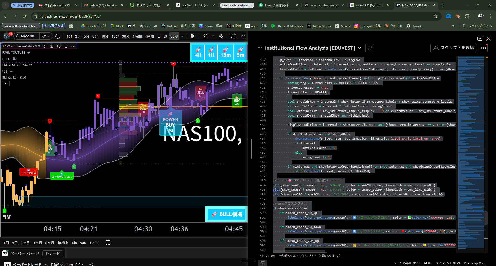 |

> 💡 For access, contact via [Upwork](https://www.upwork.com/freelancers/seiichiT) or [Fiverr](https://fiverr.com/eduvest)

👉 [View all scripts on TradingView](https://www.tradingview.com/u/EduVest_doro/#published-scripts)

---

## 🔧 MQL5 Indicators (MetaTrader 5)

**6 custom indicators** for MT5

| Indicator | Description |
|:--|:--|
| QQE Showtime v1.0 | Smoothed RSI with Dynamic Volatility Bands |
| ICT Killzone Sessions | Asian/London/NY with Silver Bullet Windows |
| BB Squeeze Momentum | Bollinger Bands × Keltner Channel Squeeze |
| MTF Trend Dashboard | Multi-Timeframe EMA/RSI/ADX Panel |
| Session VWAP | Volume Weighted Average Price with SD Bands |
| ICT Order Block Detector | Smart Money Concepts Auto-Detection |

---

## 💻 Platform Expertise

| Platform | Language | Experience |
|:--|:--|:--|
| **TradingView** | Pine Script v6 | 12 published scripts, 679+ boosts |
| **MetaTrader 4/5** | MQL4 / MQL5 | EA development, custom indicators, strategy optimization |
| **NinjaTrader 8** | NinjaScript (C#) | QQE strategies, order flow, backtesting |
| **TradeStation** | EasyLanguage | Strategy automation |
| **cTrader** | cAlgo (C#) | Breakout bots, indicator development |
| **Bybit API** | Python | Crypto trading bots |
| **Schwab API** | Python | US equities integration |

---

## 📂 Repository Structure

```
trading-portfolio/
├── images/
│   ├── trading/          # Trading platform screenshots & proof
│   │   ├── I-01 ~ I-07   MetaTrader, Pine Script, NinjaTrader, ES Futures
│   │   ├── I-08 ~ I-10   YouTube live trading & profit proof
│   │   ├── I-21           Bybit API bot management
│   │   └── I-41 ~ I-42   NinjaTrader & TradeStation QQE
│   ├── education/        # STEM education app screenshots
│   │   ├── I-22 ~ I-24   Math (Sine Rule, College Algebra, Data Science)
│   │   ├── I-29           Physics FBD Quiz
│   │   └── I-30           College Algebra (English)
│   └── indicators/       # MQL5 indicator chart previews
│       ├── rectangular/   6 images (750×500) for MQL5 Code Base
│       └── square/        6 images (500×500) for profiles
├── code/
│   ├── ninjatrader/
│   │   └── QQEv6.cs      # QQE v6 Strategy (NinjaScript)
│   └── pinescript/        # TradingView Pine Script collection (open source)
│       └── README.md      # 11 open source indicators (504+ boosts)
├── proposals/            # 5AI Integrated Proposal Samples
│   ├── P-42  Gemini AI Wrapper
│   ├── P-44  AI Product Builder Mentor
│   ├── P-45  Schwab API Integration
│   ├── P-46  SMT Divergence (TradingView)
│   ├── P-47  Knowledge Graph (Higher Education)
│   └── P-48  Excel + AI → WordPress Automation
├── BB_Squeeze_Momentum.mq5
├── ICT_Killzone_Sessions.mq5
├── ICT_OrderBlock_Detector.mq5
├── MTF_Trend_Dashboard.mq5
├── QQE_Showtime_v1.mq5
└── Session_VWAP.mq5
```

---

## 📸 Trading Screenshots

### MetaTrader 5 Development
| MQL5 Development (MetaEditor) | MT5 Live Multi-Indicator |
|:--:|:--:|
| 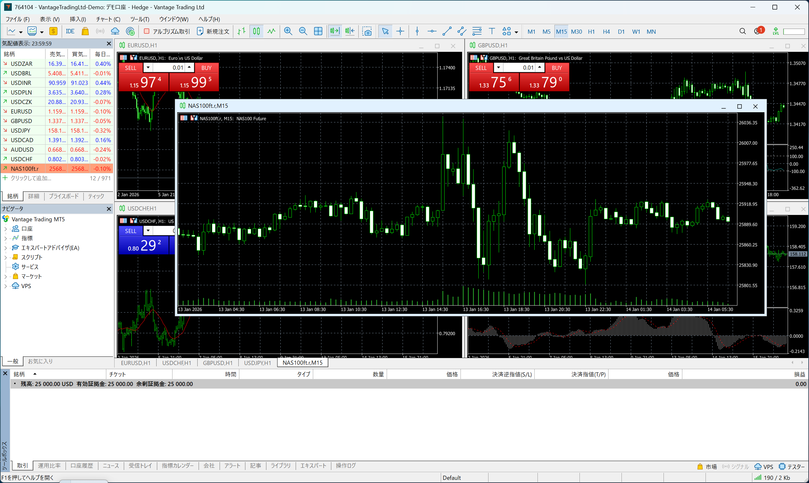 | 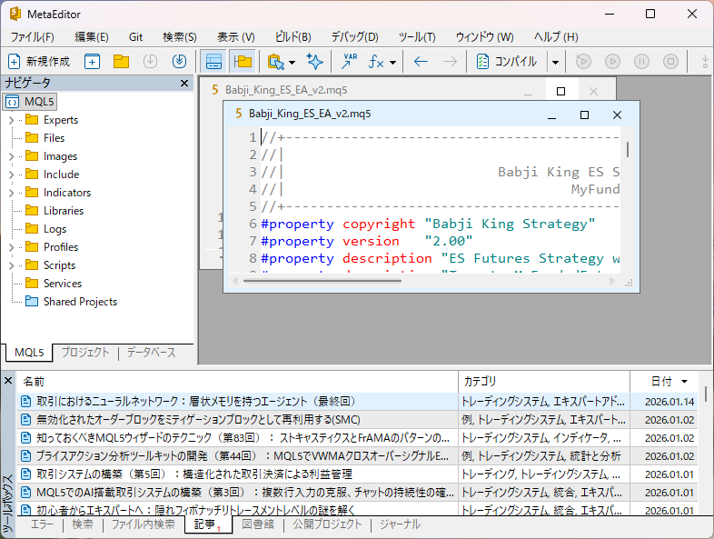 |

### Strategy Performance
| QQE Showtime (64% Win) | MT5 Trend Follow (65% Win) |
|:--:|:--:|
| 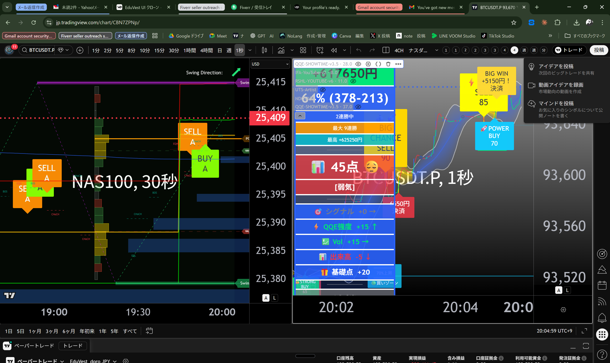 | 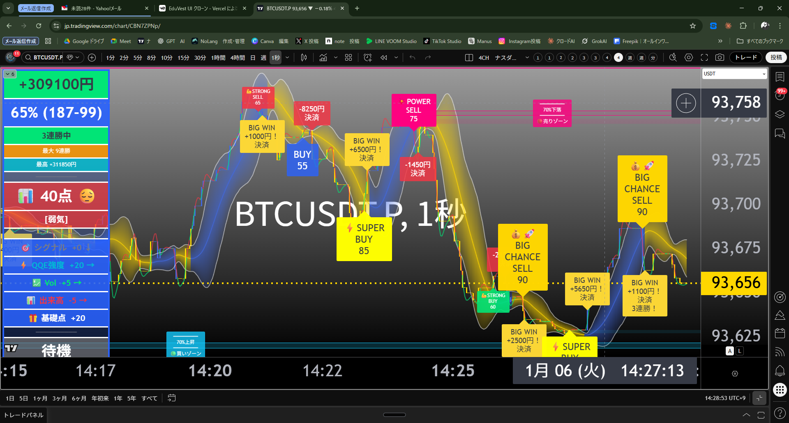 |

### Multi-Platform
| Pine Script | TradingView Scripts | ES Futures |
|:--:|:--:|:--:|
|  | 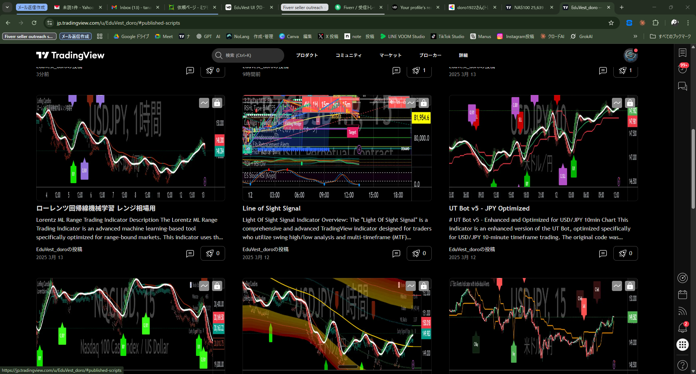 | 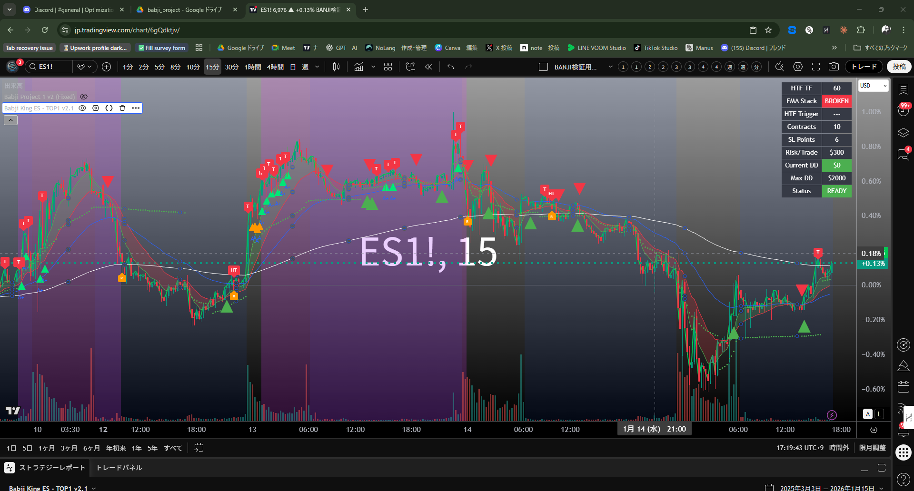 |

### YouTube Trading Channel
| Live GBPJPY | Channel Overview | BTC +1.37M JPY |
|:--:|:--:|:--:|
| 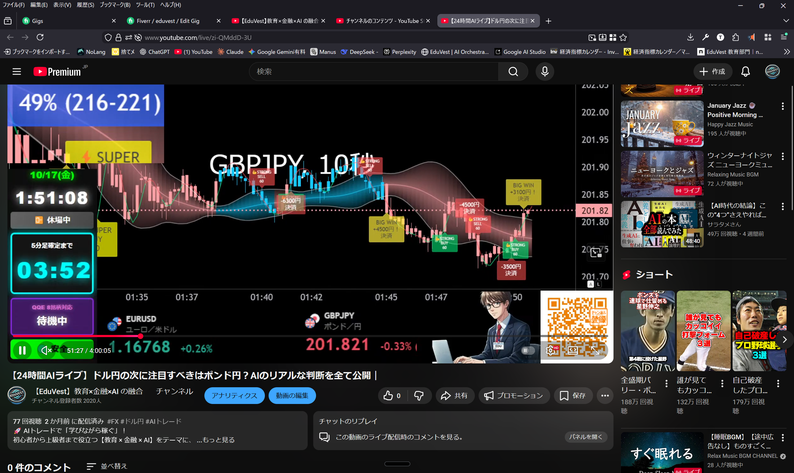 |  | 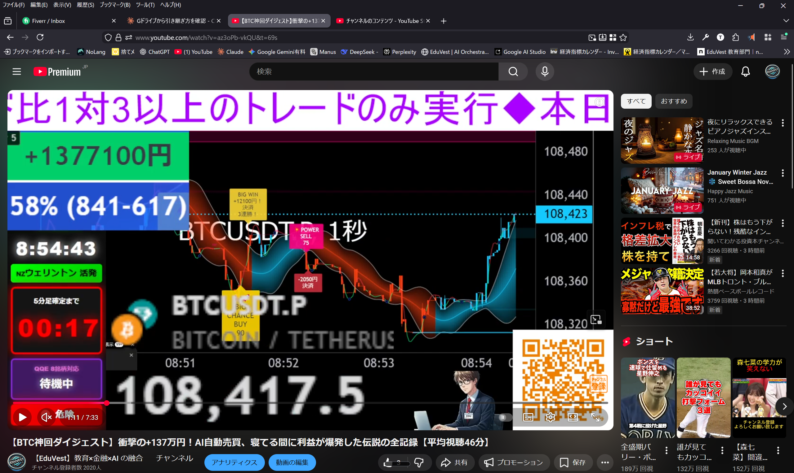 |

---

## 🎓 Education Portfolio

30 years of STEM education experience, developing interactive learning applications:

| Math (Sine Rule) | Data Science (530 Q) | Physics FBD | College Algebra |
|:--:|:--:|:--:|:--:|
| 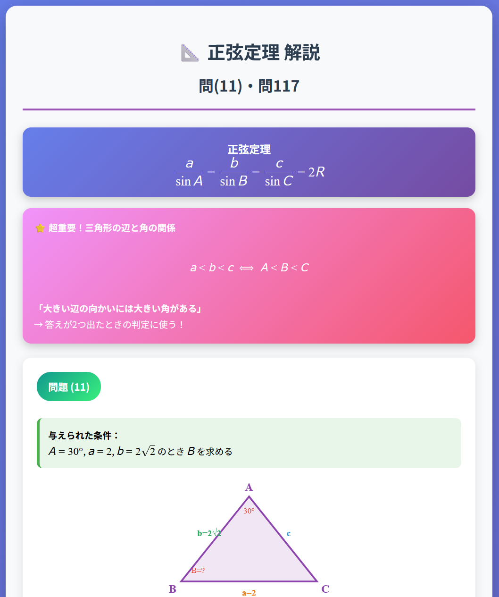 | 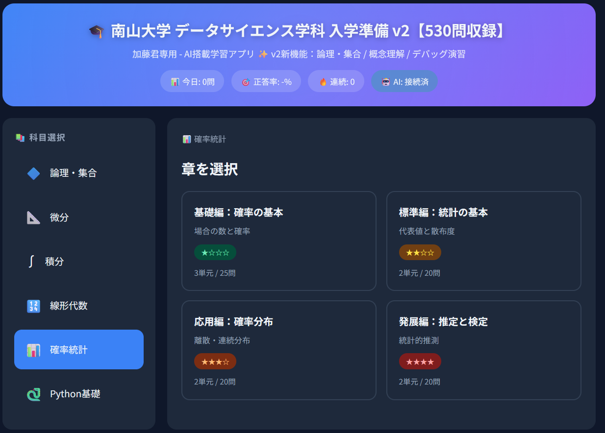 | 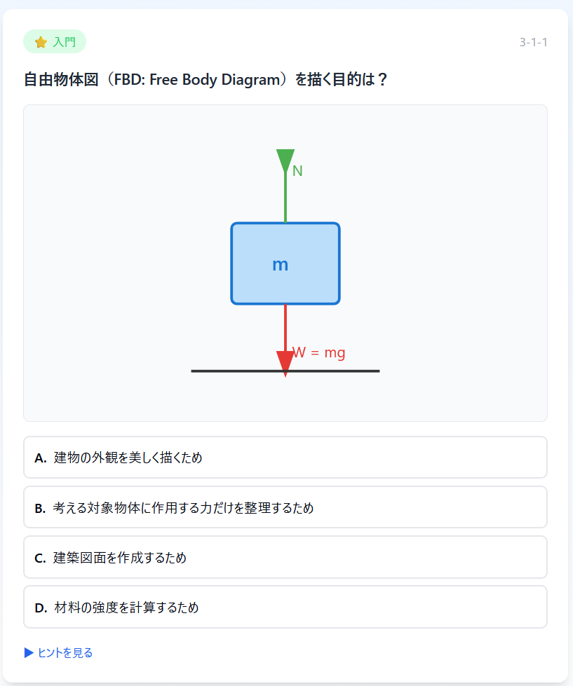 |  |

---

## 🤖 5AI Orchestration

I integrate **5 AI platforms** (Claude, Gemini, ChatGPT, Grok, Manus) for comprehensive development:
- **Research & Analysis** → Gemini Deep Research
- **Code Generation** → Claude + ChatGPT
- **Real-time Data** → Grok
- **Documentation** → Claude
- **Visual Design** → Manus

---

## 📬 Contact & Links

| Platform | Link |
|:--|:--|
| **TradingView** | [EduVest_doro](https://www.tradingview.com/u/EduVest_doro/) |
| **MQL5** | [Seiichi Tanaka](https://www.mql5.com/en/users/doro1922) |
| **YouTube** | [@EduVest_CFDFX](https://www.youtube.com/@EduVest_CFDFX) |
| **Upwork** | [Seiichi T. - STEM Educator & Trading Developer](https://www.upwork.com/freelancers/seiichiT) |
| **Fiverr** | [eduvest](https://fiverr.com/eduvest) |

---

*© 2026 Seiichi Tanaka | EduVest — 30 Years STEM Education × AI-Powered Trading Tools*
